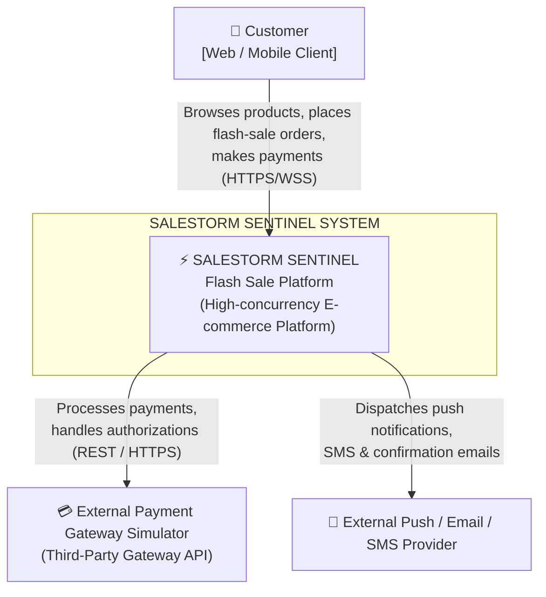
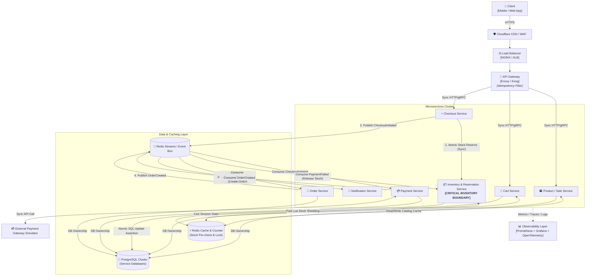
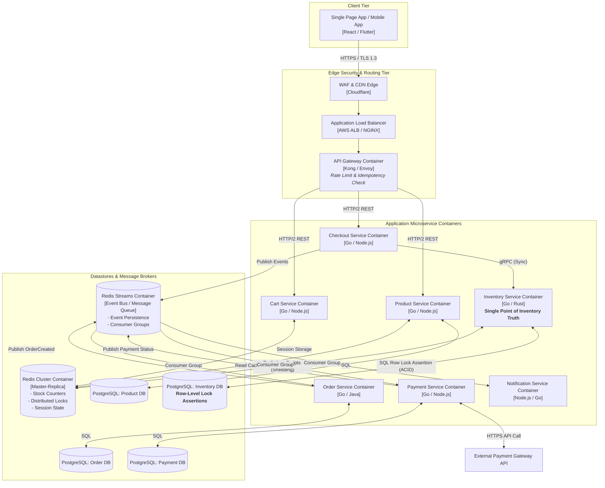
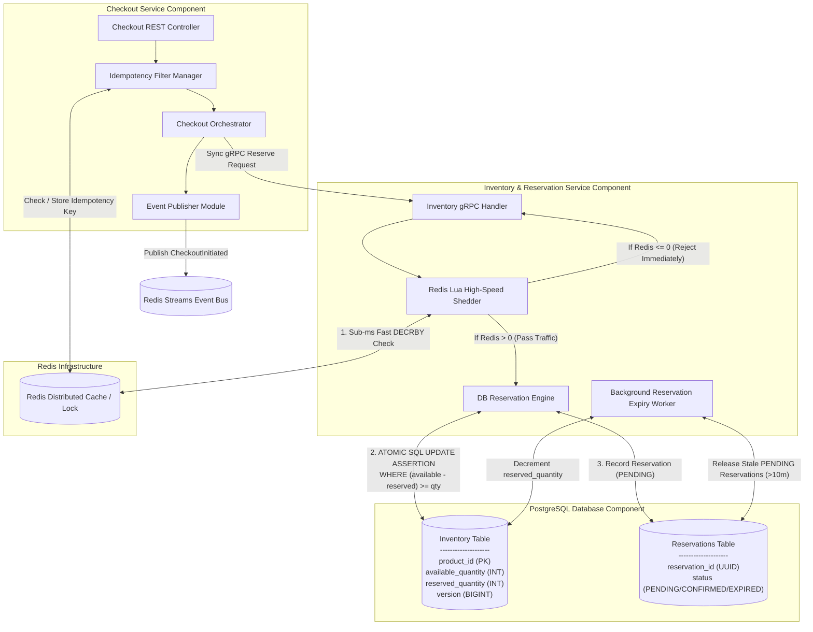
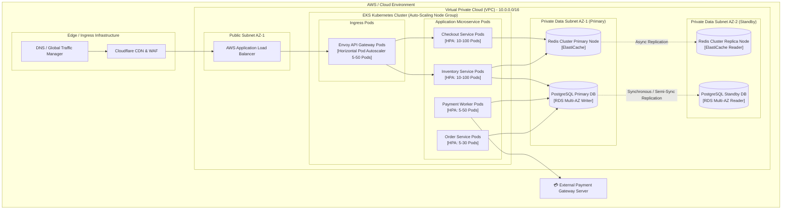

# SALESTORM SENTINEL Architecture Diagrams

This document contains full Mermaid diagrams for the **SALESTORM SENTINEL** flash-sale architecture.

---

## 1. System Context Diagram (C4 Level 1)

Visualizes the high-level boundary of SALESTORM SENTINEL, its end users, and third-party integrations.

---

## 2. High-Level Architecture Diagram

Overview of all components, sync/async flows, cache usage, databases, and event bus boundaries.

---

## 3. Container Diagram (C4 Level 2)

Shows application containers, datastores, protocols, and queue boundaries.

---

## 4. Component Diagram (C4 Level 3 - Inventory & Checkout Focus)

Internal sub-components detailing **Where overselling is prevented**, **Idempotency**, and **Failure boundaries**.

---

## 5. Deployment Diagram

Infrastructure deployment across Cloud Provider Availability Zones, Auto-Scaling Groups, and Kubernetes Clusters.

---

## 6. Summary of Architectural Design Guarantees

| Design Aspect | Implementation Details |
| :--- | :--- |
| **Preventing Overselling** | **Single Point of Truth:** PostgreSQL atomic row update `WHERE (available_quantity - reserved_quantity) >= :qty`. Dropped by Redis if stock counter hits 0. |
| **High Concurrency Support** | 10,000 requests shed to 100 requests in sub-milliseconds via Redis Lua pre-reservation before reaching DB lock engine. |
| **Idempotency** | Keyed by `X-Idempotency-Key` headers saved in Redis with distributed locking during transaction execution. |
| **Asynchronous Order Processing** | Payments and order generation happen asynchronously via partitioned Redis Streams, preventing DB write spikes during peak checkout. |
| **Fault Resilience** | Circuit breakers on external gateways, event replay from streams on service outages, and background expiry workers for payment timeouts. |
