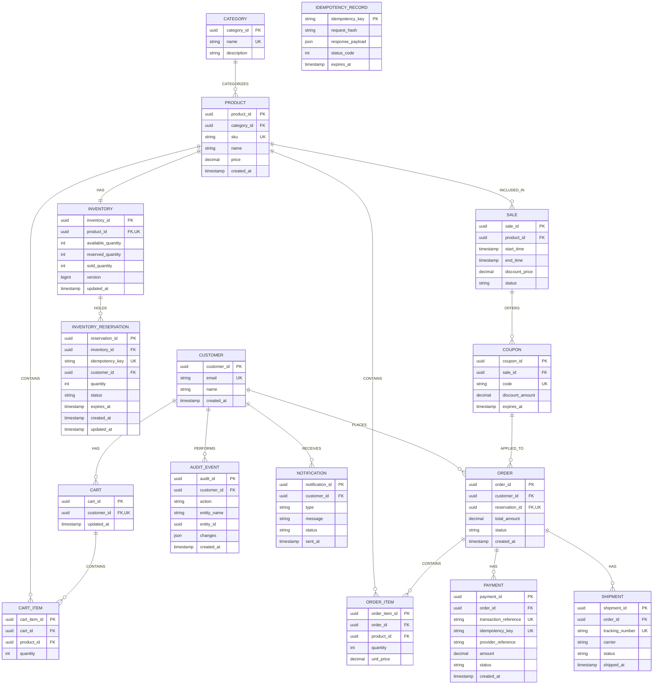

# SALESTORM SENTINEL: Database Entity-Relationship Diagram

## Entity-Relationship Diagram (Mermaid)

```mermaid
erDiagram
    CUSTOMER ||--o{ CART : HAS
    CUSTOMER ||--o{ ORDER : PLACES
    CUSTOMER ||--o{ AUDIT_EVENT : PERFORMS
    
    CATEGORY ||--o{ PRODUCT : CATEGORIZES
    
    PRODUCT ||--|| INVENTORY : HAS
    PRODUCT ||--o{ CART_ITEM : CONTAINS
    PRODUCT ||--o{ ORDER_ITEM : CONTAINS
    PRODUCT ||--o{ SALE : INCLUDED_IN
    
    CART ||--o{ CART_ITEM : CONTAINS
    
    INVENTORY ||--o{ INVENTORY_RESERVATION : HOLDS
    
    ORDER ||--o{ ORDER_ITEM : CONTAINS
    ORDER ||--o{ PAYMENT : HAS
    ORDER ||--o{ SHIPMENT : HAS
    
    CUSTOMER ||--o{ NOTIFICATION : RECEIVES
    SALE ||--o{ COUPON : OFFERS
    COUPON ||--o{ ORDER : APPLIED_TO

    CUSTOMER {
        uuid customer_id PK
        string email UK
        string name
        timestamp created_at
    }

    CATEGORY {
        uuid category_id PK
        string name UK
        string description
    }

    PRODUCT {
        uuid product_id PK
        uuid category_id FK
        string sku UK
        string name
        decimal price
        timestamp created_at
    }

    INVENTORY {
        uuid inventory_id PK
        uuid product_id FK,UK
        int available_quantity
        int reserved_quantity
        int sold_quantity
        bigint version
        timestamp updated_at
    }

    INVENTORY_RESERVATION {
        uuid reservation_id PK
        uuid inventory_id FK
        string idempotency_key UK
        uuid customer_id FK
        int quantity
        string status
        timestamp expires_at
        timestamp created_at
        timestamp updated_at
    }

    CART {
        uuid cart_id PK
        uuid customer_id FK,UK
        timestamp updated_at
    }

    CART_ITEM {
        uuid cart_item_id PK
        uuid cart_id FK
        uuid product_id FK
        int quantity
    }

    ORDER {
        uuid order_id PK
        uuid customer_id FK
        uuid reservation_id FK,UK
        decimal total_amount
        string status
        timestamp created_at
    }

    ORDER_ITEM {
        uuid order_item_id PK
        uuid order_id FK
        uuid product_id FK
        int quantity
        decimal unit_price
    }

    PAYMENT {
        uuid payment_id PK
        uuid order_id FK
        string transaction_reference UK
        string idempotency_key UK
        string provider_reference
        decimal amount
        string status
        timestamp created_at
    }

    SALE {
        uuid sale_id PK
        uuid product_id FK
        timestamp start_time
        timestamp end_time
        decimal discount_price
        string status
    }

    COUPON {
        uuid coupon_id PK
        uuid sale_id FK
        string code UK
        decimal discount_amount
        timestamp expires_at
    }

    SHIPMENT {
        uuid shipment_id PK
        uuid order_id FK
        string tracking_number UK
        string carrier
        string status
        timestamp shipped_at
    }

    NOTIFICATION {
        uuid notification_id PK
        uuid customer_id FK
        string type
        string message
        string status
        timestamp sent_at
    }

    IDEMPOTENCY_RECORD {
        string idempotency_key PK
        string request_hash
        json response_payload
        int status_code
        timestamp expires_at
    }

    AUDIT_EVENT {
        uuid audit_id PK
        uuid customer_id FK
        string action
        string entity_name
        uuid entity_id
        json changes
        timestamp created_at
    }
```
