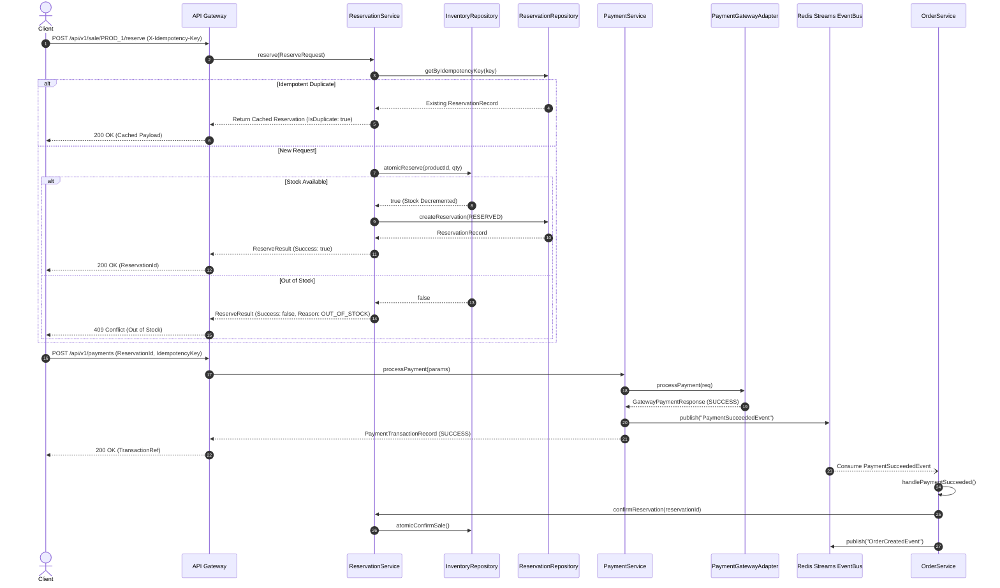
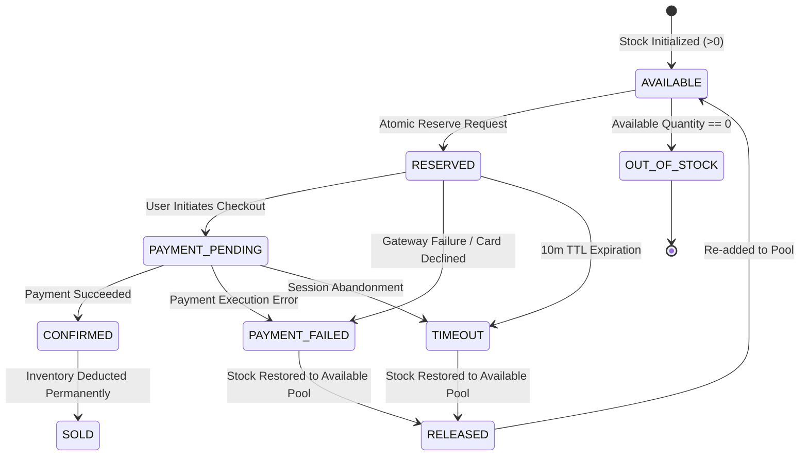
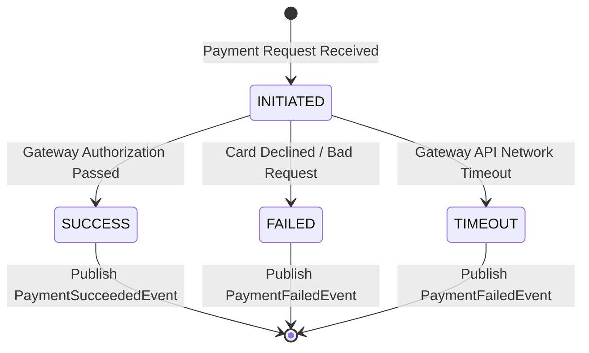

# SALESTORM SENTINEL: Low-Level Design (LLD)

This document contains detailed **Class Diagrams**, **Sequence Diagrams**, and **State Diagrams** using Mermaid for the three core domains: **Inventory**, **Payment**, and **Order**.

---

## 1. Class Diagrams

```mermaid
classDiagram
    %% Interfaces
    class IInventoryRepository {
        <<interface>>
        +initProductInventory(productId: string, initialQuantity: number) Promise~InventoryRecord~
        +getInventory(productId: string) Promise~InventoryRecord~
        +atomicReserve(productId: string, quantity: number) Promise~boolean~
        +atomicRelease(productId: string, quantity: number) Promise~boolean~
        +atomicConfirmSale(productId: string, quantity: number) Promise~boolean~
    }

    class IReservationRepository {
        <<interface>>
        +createReservation(reservation: ReservationRecord) Promise~ReservationRecord~
        +getByIdempotencyKey(key: string) Promise~ReservationRecord~
        +getById(reservationId: string) Promise~ReservationRecord~
        +updateStatus(reservationId: string, status: ReservationStatus) Promise~ReservationRecord~
        +findExpiredReservations(now: Date) Promise~ReservationRecord[]~
    }

    class InventoryLockStrategy {
        <<interface>>
        +acquireLock(key: string) Promise~ReleaseFunction~
    }

    class IPaymentGatewayAdapter {
        <<interface>>
        +processPayment(req: GatewayPaymentRequest) Promise~GatewayPaymentResponse~
    }

    class IPpaymentRepository {
        <<interface>>
        +createPayment(record: PaymentTransactionRecord) Promise~PaymentTransactionRecord~
        +getByIdempotencyKey(key: string) Promise~PaymentTransactionRecord~
        +getByTransactionRef(ref: string) Promise~PaymentTransactionRecord~
        +updateStatus(ref: string, status: PaymentTxStatus) Promise~PaymentTransactionRecord~
    }

    class IOrderRepository {
        <<interface>>
        +createOrder(order: OrderRecord) Promise~OrderRecord~
        +getById(orderId: string) Promise~OrderRecord~
        +getByTransactionRef(ref: string) Promise~OrderRecord~
        +getByReservationId(reservationId: string) Promise~OrderRecord~
    }

    class IEventBus {
        <<interface>>
        +publish(streamName: string, eventType: string, payload: any) Promise~string~
        +subscribe(streamName: string, consumerGroup: string, consumerName: string, handler: Function) Promise~void~
        +getPendingMessages(streamName: string, consumerGroup: string, consumerName: string) Promise~Array~
    }

    %% Service Concrete Classes
    class InventoryService {
        -inventoryRepo: IInventoryRepository
        +setupInventory(productId: string, qty: number) Promise~InventoryRecord~
        +getInventory(productId: string) Promise~InventoryRecord~
    }

    class ReservationService {
        -inventoryRepo: IInventoryRepository
        -reservationRepo: IReservationRepository
        +reserve(req: ReserveRequest) Promise~ReserveResult~
        +markPaymentPending(reservationId: string) Promise~ReservationRecord~
        +confirmReservation(reservationId: string) Promise~ReservationRecord~
        +handlePaymentFailure(reservationId: string) Promise~ReservationRecord~
        +expireStaleReservations(now: Date) Promise~number~
    }

    class PaymentService {
        -paymentRepo: IPpaymentRepository
        -gatewayAdapter: IPaymentGatewayAdapter
        -eventBus: IEventBus
        +processPayment(params: ProcessPaymentParams) Promise~PaymentTransactionRecord~
    }

    class OrderService {
        -orderRepo: IOrderRepository
        -eventBus: IEventBus
        -reservationService: ReservationService
        -isServiceAvailable: boolean
        +handlePaymentSucceeded(payload: PaymentSucceededEventPayload) Promise~boolean~
        +recoverPendingEvents() Promise~number~
        +setAvailability(available: boolean) void
    }

    class SimulatedPaymentGatewayAdapter {
        -circuitBreakerState: string
        -consecutiveFailures: number
        +processPayment(req: GatewayPaymentRequest) Promise~GatewayPaymentResponse~
    }

    %% Relationships
    ReservationService --> IInventoryRepository
    ReservationService --> IReservationRepository
    InventoryService --> IInventoryRepository
    PaymentService --> IPpaymentRepository
    PaymentService --> IPaymentGatewayAdapter
    PaymentService --> IEventBus
    OrderService --> IOrderRepository
    OrderService --> IEventBus
    OrderService --> ReservationService
    SimulatedPaymentGatewayAdapter ..|> IPaymentGatewayAdapter
```

---

## 2. Sequence Diagrams

### Flash Sale Reserve & Payment Flow (Happy Path)

---

## 3. State Diagrams

### A. Inventory Reservation Lifecycle State Machine

### B. Payment Transaction State Machine

